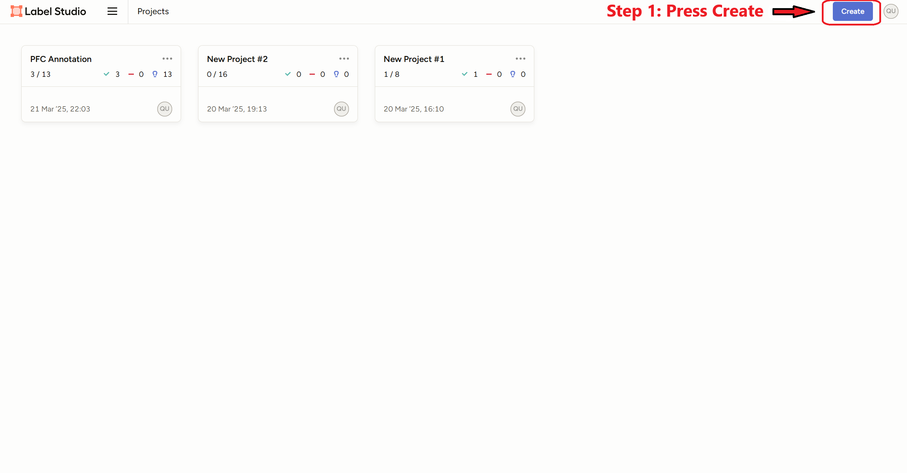
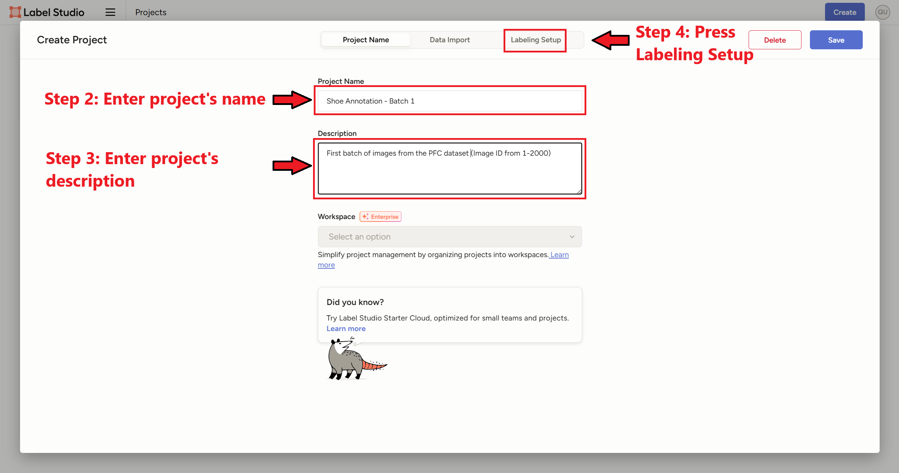
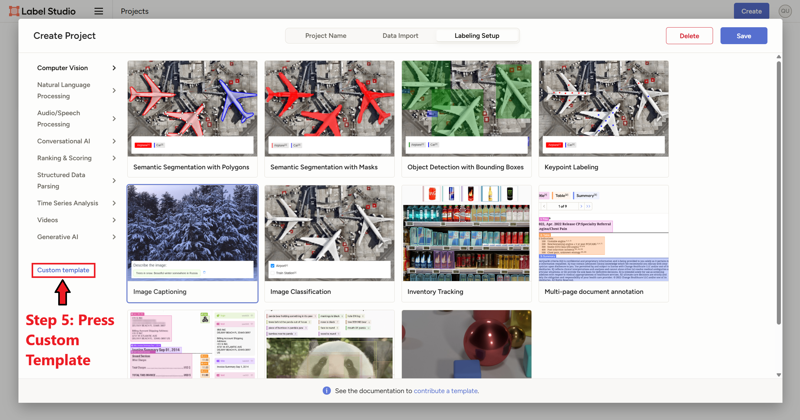
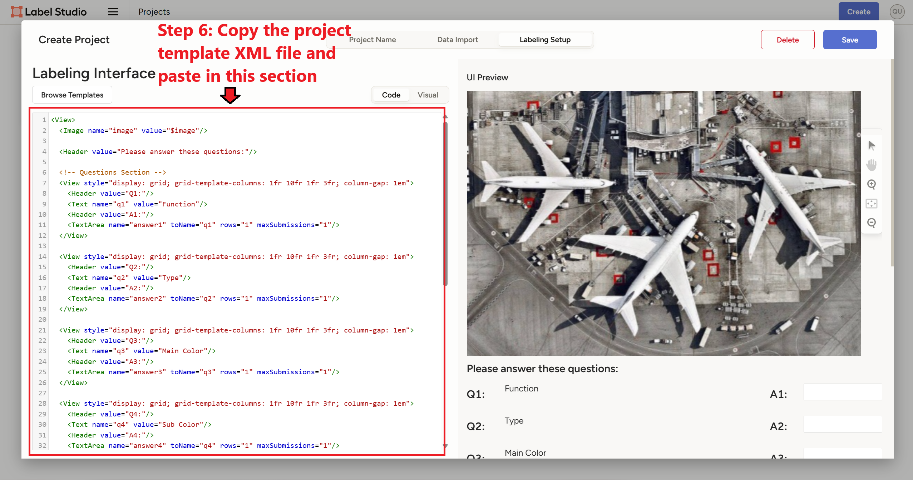
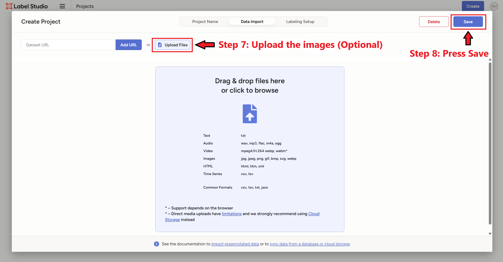
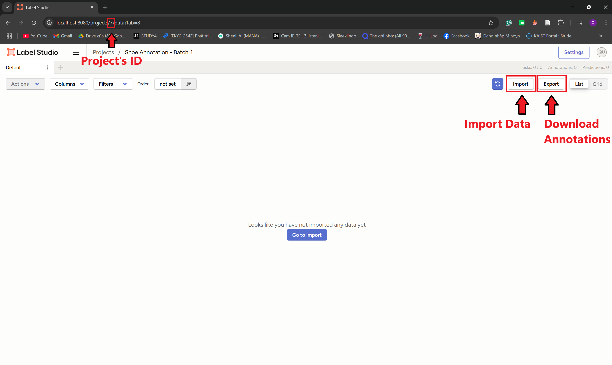

## Descriptions
Templates for Label Studio setup, and instructions on how to upload the data.

## Label Studio setup
### Step 1. Create Project

Connect to the Label Studio server (*http://localhost:8080/* if your server is deployed locally). Press **Create** to start creating a new Label Studio project.

### Step 2. Specify Project's Name and Description
You can specify the project's name and description. Afterward, press **Labeling Setup** to modify the Labeling Interface.

### Step 3. Customize the Project Template
In the Labeling Setup tab, you can select the template for the labeling process. You can choose from the predefined templates, or create a custom one. In this example, we will create a custom template from the *.xml* files.

### Step 4. Custom Labeling Interface Setup
In this example, we will use the *./Project_Templates/shoe_attributes_v_1.0.0.xml* file to define the labeling interface. Simply copy and paste the content of the file to the "Code" section.

### Step 5. Upload Data
After creating the labeling interface, you can upload the images directly to the server using the **Upload Files** function. This can also be done afterward, so this step is optional. However, there are **limitations** when using this function, so it is recommended to upload the files on a Cloud Storage and later import them into Label Studio through dataset's url. Afterward, press **Save** to create the project.

### Step 6. The Interface
On the labeling interface, you can see the **Project's ID** on the url. You can import data using the **Import** button, and download annotations using the **Export** button.

